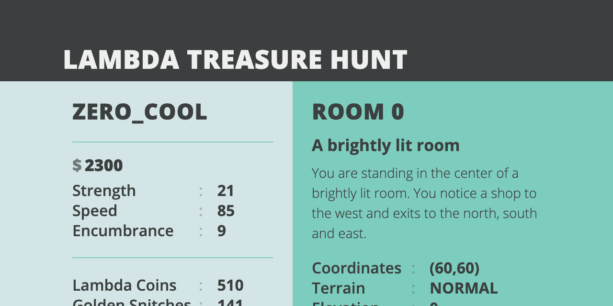

# React Treasure Client

React client for interacting with the [Lambda treasure hunt](https://github.com/LambdaSchool/CS-Build-Week-2).



## Setup

To connect, clone project and run `npm install`.

Create a `.env` file in the project root and set `REACT_APP_TOKEN` to your game API key, like so:

```
REACT_APP_TOKEN=YOUR_API_KEY_HERE
```

Use `npm run start` to start the client.

## Usage


Click on any room in the map to navigate. Open the browser console to see more detailed updates.

Selecting `Mine Lambda Coins` or `Find Golden Snitches` will set the client into an automated hunting state. Refreshing the page is necessary to stop the operation.

**WARNING:** Currently this app assumes the player has unlocked the abilities _fly_ and _dash_. Attempting to navigate without these abilities unlocked will result in a **severe** cooldown punishment. This will be fixed in a future release.

---

#### Future Functionality

###### Internal Fixes

- Properly parse cooldown from bad API calls
- Automatically detect if player has unlocked _fly_ and _dash_
- Override API key (currently non-functional)
- Auto-reconnect if client connects too quickly for cooldown (currently needs a manual page refresh)

###### User Interface

- More descriptive text on dashing
- Updated graphics for world map
- Ability to interact with ghost (if unlocked)
- Ability to sell at the shop
- Ability to transmogrify items at the Transmogrifier
- Ability to change name at Pirate Ry's
